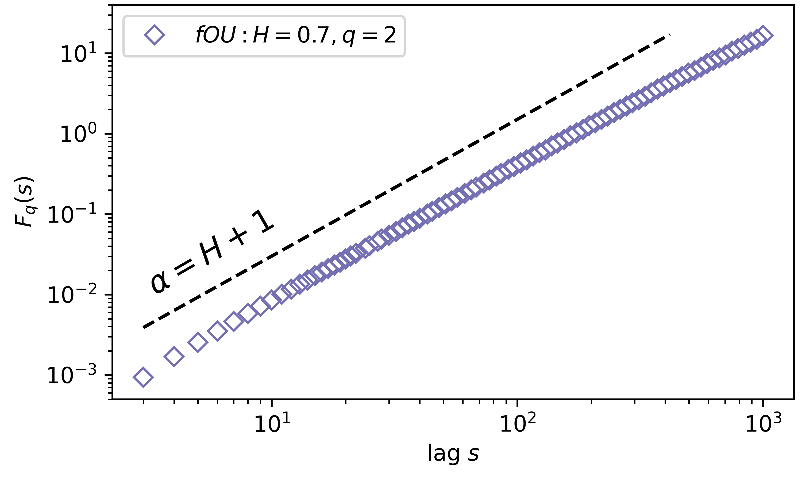

[](https://zenodo.org/badge/latestdoi/224135077)


[](https://travis-ci.org/LRydin/MFDFA)
[](https://codecov.io/gh/LRydin/MFDFA)
[](https://mfdfa.readthedocs.io/en/latest/?badge=latest)


# MFDFA
Multifractal Detrended Fluctuation Analysis `MFDFA` is a model-independent method to uncover the self-similarity of a stochastic process or auto-regressive model.
`DFA` was first developed by Peng *et al.*<sup>1</sup> and later extended to study multifractality `MFDFA` by Kandelhardt *et al.*<sup>2</sup>.

In the latest release there is as well added a moving window system, especially useful for short timeseries, a recent extension to DFA called *extended DFA*, and the extra feature of Empirical Mode Decomposition as detrending method.

# Installation
To install MFDFA you can simply use

```
pip install MFDFA
```
And on your favourite editor simply import `MFDFA` as
```python
from MFDFA import MFDFA
```
There is an added library `fgn` to generate fractional Gaussian noise.

# The `MFDFA` library
`MFDFA` basis is solely dependent on `numpy`, especially `numpy`'s `polynomial`. In version 0.3 a [Empirical Mode Decomposition](https://en.wikipedia.org/wiki/Hilbert%E2%80%93Huang_transform) method was added for an alternative method of detrending timeseries, relying on [Dawid Laszuk's](https://github.com/laszukdawid/PyEMD) `PyEMD`.

# Employing the `MFDFA` library

## An exemplary one-dimensional fractional Ornstein–Uhlenbeck process
The rationale here is simple: Numerically integrate a stochastic process in which we know exactly the fractal properties, characterised by the Hurst coefficient, and recover this with MFDFA.
We will use a fractional Ornstein–Uhlenbeck, a commonly employ stochastic process with mean-reverting properties.
For a more detailed explanation on how to integrate an Ornstein–Uhlenbeck process, see the [kramersmoyal's package](https://github.com/LRydin/KramersMoyal#a-one-dimensional-stochastic-process).
You can also follow the [fOU.ipynb](/examples/fOU.ipynb)

### Generating a fractional Ornstein–Uhlenbeck process
This is one method of generating a (fractional) Ornstein–Uhlenbeck process with *H=0.7*, employing a simple Euler–Maruyama integration method

```python
# Imports
from MFDFA import MFDFA
from MFDFA import fgn
# where this second library is to generate fractional Gaussian noises

# integration time and time sampling
t_final = 500
delta_t = 0.001

# Some drift theta and diffusion sigma parameters
theta = 0.3
sigma = 0.1

# The time array of the trajectory
time = np.arange(0, t_final, delta_t)

# The fractional Gaussian noise
H = 0.7
dB = (t_final ** H) * fgn(N = time.size, H = H)

# Initialise the array y
y = np.zeros([time.size])

# Integrate the process
for i in range(1, time.size):
    y[i] = y[i-1] - theta * y[i-1] * delta_t + sigma * dB[i]
```
And now you have a fractional process with a self-similarity exponent *H=0.7*

### Using the `MFDFA`
To now utilise the `MFDFA`, we take this exemplary process and run the (multifractal) detrended fluctuation analysis. For now lets consider only the monofractal case, so we need only `q=2`.
```python
# Select a band of lags, which usually ranges from
# very small segments of data, to very long ones, as
lag = np.unique(np.logspace(0.5, 3, 100).astype(int))
# Notice these must be ints, since these will segment
# the data into chucks of lag size

# Select the power q
q = 2

# The order of the polynomial fitting
order = 1

# Obtain the (MF)DFA as
lag, dfa = MFDFA(y, lag = lag, q = q, order = order)
```

Now we need to visualise the results, which can be understood in a log-log scale. To find *H* we need to fit a line to the results in the log-log plot
```python
# To uncover the Hurst index, lets get some log-log plots
plt.loglog(lag, dfa, 'o', label='fOU: MFDFA q=2')

# And now we need to fit the line to find the slope. We will
# fit the first points, since the results are more accurate
# there. Don't forget that if you are seeing in log-log
# scales, you need to fit the logs of the results
np.polyfit(np.log(lag[:15]), np.log(dfa[:15]),1)[0]

# Now what you should obtain is: slope = H + 1
```




## Uncovering multifractality in stochastic processes
You can find more about multifractality in the [documentation](https://mfdfa.readthedocs.io/en/latest/1dLevy.html).

# Changelog
- Version 0.4 - EMD is now optional. Restored back compatibility: py3.3 to py3.9. For EMD py3.6 or larger is needed.
- Version 0.3 - Adding EMD detrending. First release. PyPI code.
- Version 0.2 - Removed experimental features. Added documentation
- Version 0.1 - Uploaded initial working code

# Contributions
I welcome reviews and ideas from everyone. If you want to share your ideas or report a bug, open an [issue](https://github.com/LRydin/KramersMoyal/issues) here on GitHub, or contact me directly.
If you need help with the code, the theory, or the implementation, do not hesitate to reach out, I am here to help.
This package abides to a [Conduct of Fairness](contributions.md).

# Literature and Support
### Submission history
This library has been submitted for publication at [The Journal of Open Source Software](https://joss.theoj.org/) in December 2019. It was rejected. The review process can be found [here on GitHub](https://github.com/openjournals/joss-reviews/issues/1966). The plan is to extend the library and find another publisher.

### History
This project was started in 2019 at the [Faculty of Mathematics, University of Oslo](https://www.mn.uio.no/math/english/research/groups/risk-stochastics/) in the Risk and Stochastics section by Leonardo Rydin Gorjão and is supported by Dirk Witthaut and the [Institute of Energy and Climate Research Systems Analysis and Technology Evaluation](https://www.fz-juelich.de/iek/iek-ste/EN/Home/home_node.html). I'm very thankful to all the folk in Section 3 in the Faculty of Mathematics, University of Oslo, for helping me getting around the world of stochastic processes: Dennis, Anton, Michele, Fabian, Marc, Prof. Benth and Prof. di Nunno. In April 2020 Galib Hassan joined in extending `MFDFA`, particularly the implementation of `EMD`.


### Funding
Helmholtz Association Initiative *Energy System 2050 - A Contribution of the Research Field Energy* and the grant No. VH-NG-1025; *STORM - Stochastics for Time-Space Risk Models* project of the Research Council of Norway (RCN) No. 274410, and the *E-ON Stipendienfonds*.

### References
<sup>1</sup>Peng, C.-K., Buldyrev, S. V., Havlin, S., Simons, M., Stanley, H. E., & Goldberger, A. L. (1994). *Mosaic organization of DNA nucleotides*. [Physical Review E, 49(2), 1685–1689](https://doi.org/10.1103/PhysRevE.49.1685)\
<sup>2</sup>Kantelhardt, J. W., Zschiegner, S. A., Koscielny-Bunde, E., Havlin, S., Bunde, A., & Stanley, H. E. (2002). *Multifractal detrended fluctuation analysis of nonstationary time series*. [Physica A: Statistical Mechanics and Its Applications, 316(1-4), 87–114](https://doi.org/10.1016/S0378-4371(02)01383-3)
